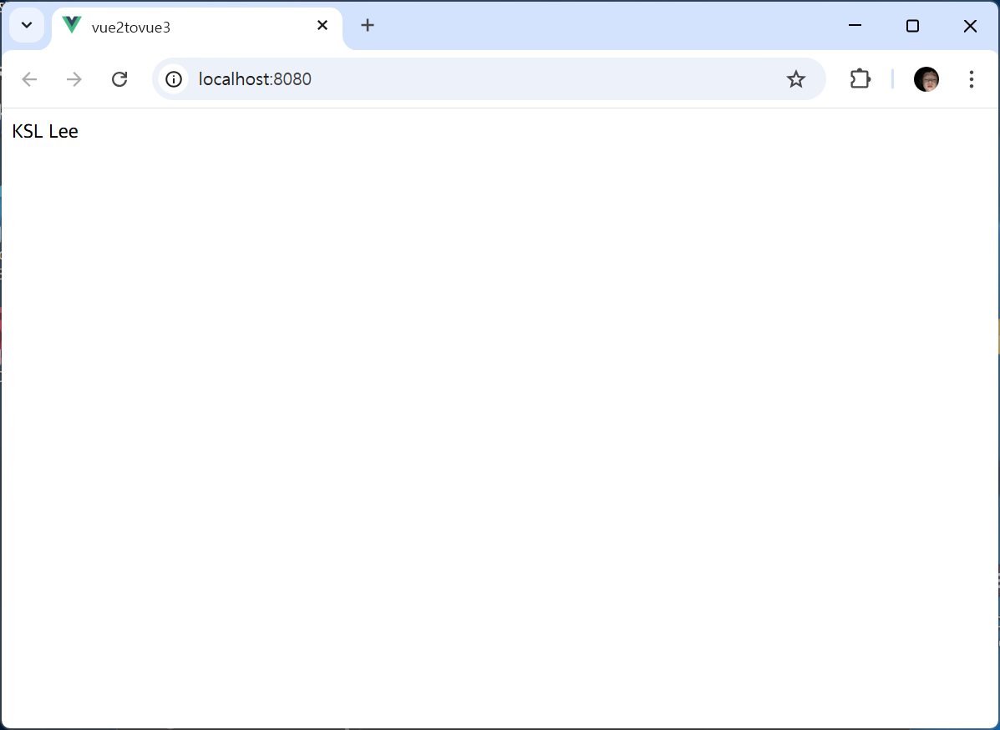
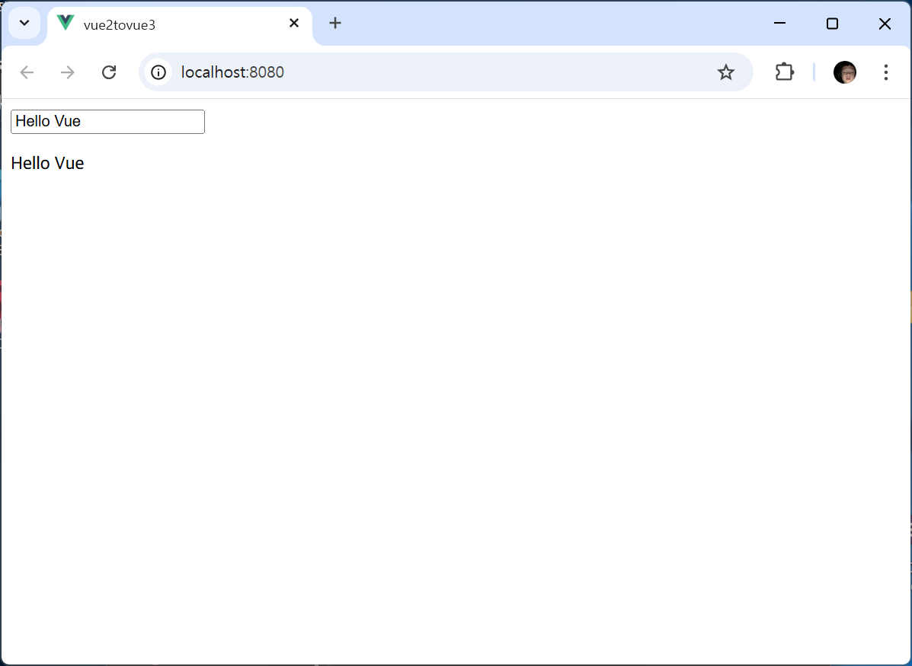
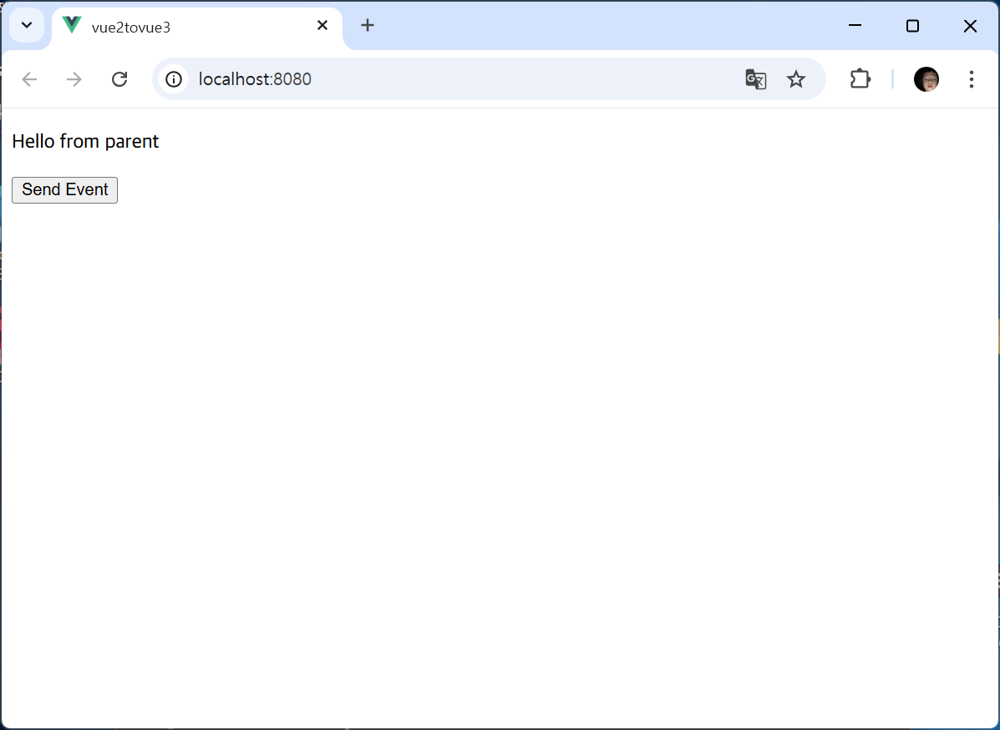
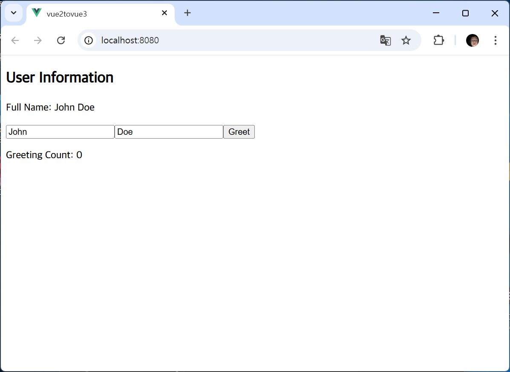
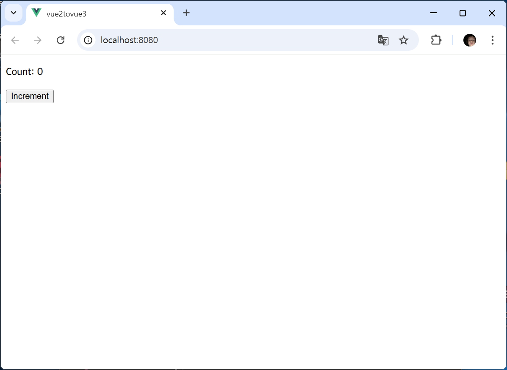
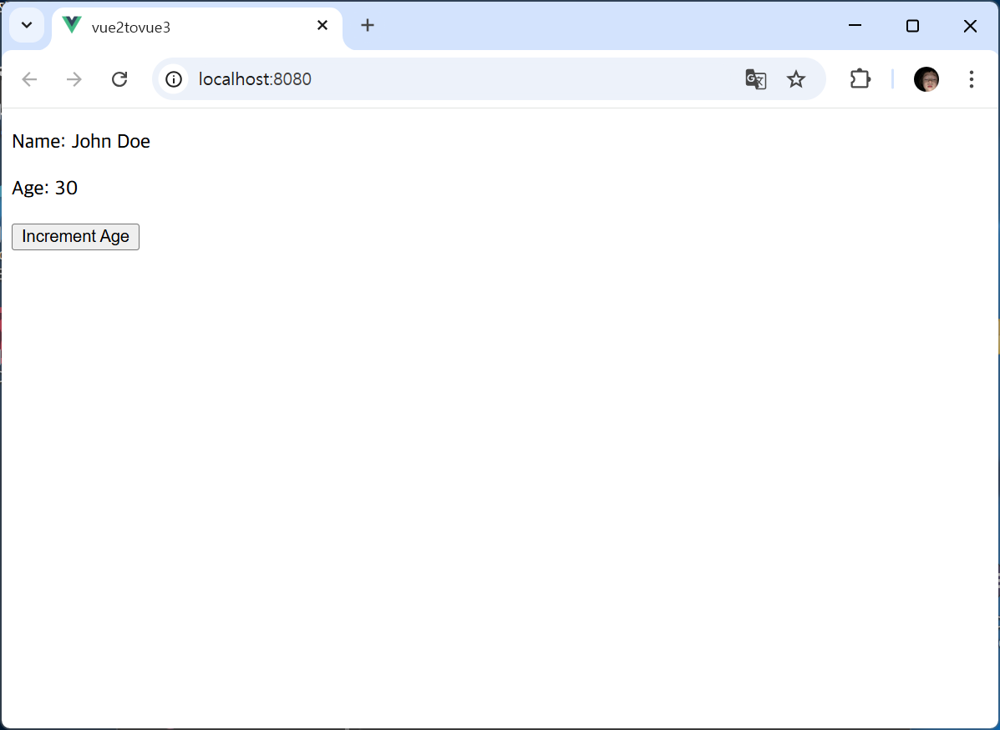
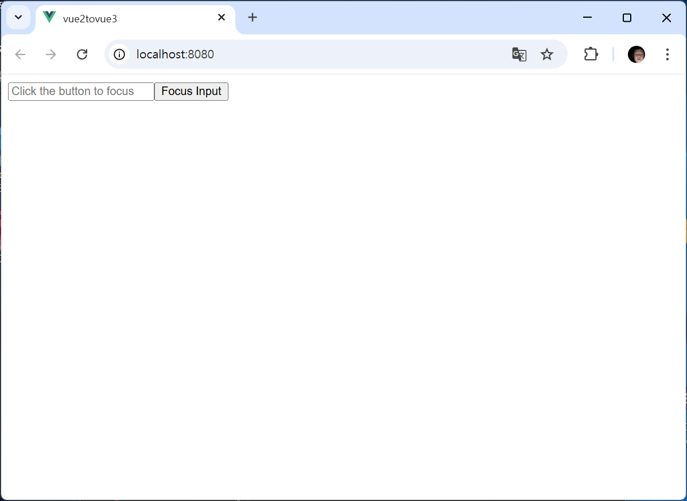

# Vue 2 → Vue 3 전환

---

## Vue 2 → Vue 3 매핑 요약
- 상태 관리: `data()` → `ref` / `reactive`
- 파생 데이터: `computed` 옵션 → `computed()` 함수
- 메서드: `methods` → `setup` 내부 함수
- 감시자: `watch` 옵션 → `watch()` 함수
- 라이프사이클 훅 매핑

| Vue 2                           | Vue 3                       | 사용 방식                      |
|---------------------------------|-----------------------------|--------------------------------|
| `beforeCreate`, `created`       | `setup()` 내부에서 바로 실행        | 단순 `console.log` 등         |
| `beforeMount`                   | `onBeforeMount`             | UI 마운트 직전 로그           |
| `mounted`                       | `onMounted`                 | 마운트 후 초기 동작           |
| `beforeUpdate`                  | `onBeforeUpdate`            | 갱신 직전 로그                |
| `updated`                       | `onUpdated`                 | 갱신 후 로그                  |
| `beforeDestroy`/`beforeUnmount` | `onBeforeUnmount`           | 언마운트 직전 로그           |
| `destroyed`/`unmounted`         | `onUnmounted`               | 언마운트 후 로그             |

---

## 동작 확인용 스크린샷
| components              | 실행 화면 |
|---------------------| --------- |
| E01Instance         |  |
| E02Reactive         |  |
| E03Binding          |    |
| E04Directives       |  |
| E05ParentComponent  |  |
| E06ParentComponent  |  |
| E07OptionsApi       |  |
| E08CompositionApi   |  |
| E09CompositionApi   |  |
| E10Ref              |  |
| E11Reactive         |  |
| E12RefComponent     |  |
